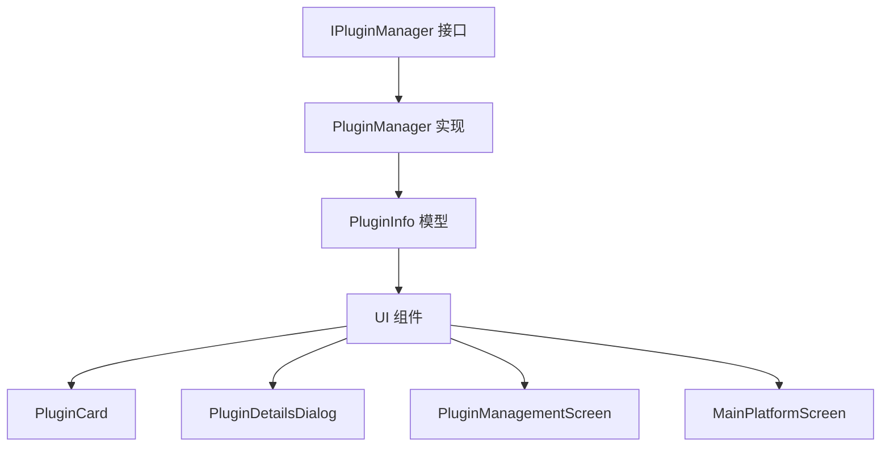

# 重构检查清单

> 📋 在进行任何涉及 API 变更的重构时，必须完整执行此检查清单

## 🔍 阶段 1: 全面搜索（重构前）

### 1.1 搜索所有使用点
```bash
# 搜索方法名
grep -r "enablePlugin\|disablePlugin\|isPluginEnabled" --include="*.dart" lib/

# 搜索可能的变量名
grep -r "isEnabled" --include="*.dart" lib/

# 搜索相关的翻译键
grep -r "plugin_enabled\|plugin_disabled\|button_enable" --include="*.arb" lib/l10n/

# 搜索接口引用
grep -r "IPluginManager" --include="*.dart" lib/
```

### 1.2 识别所有引用文件
将搜索结果整理成清单：
- [ ] 接口定义文件
- [ ] 实现类文件
- [ ] UI 组件文件
- [ ] 测试文件
- [ ] 文档文件

### 1.3 分析依赖关系
```bash
# 查找导入相关模块的文件
grep -r "import.*plugin_manager" --include="*.dart" lib/
grep -r "import.*i_plugin_manager" --include="*.dart" lib/
```

## 📝 阶段 2: 修改执行（重构中）

### 2.1 按依赖顺序修改
1. **先修改接口** (`IPluginManager`)
2. **再修改实现** (`PluginManager`, `PluginRegistryEntry`)
3. **然后修改数据模型** (`PluginInfo`)
4. **最后修改 UI** (所有使用 `isEnabled` 的组件)

### 2.2 每个文件修改后立即标记
- [ ] `lib/core/interfaces/i_plugin_manager.dart`
- [ ] `lib/core/services/plugin_manager.dart`
- [ ] `lib/core/models/plugin_models.dart`
- [ ] `lib/ui/widgets/plugin_card.dart`
- [ ] `lib/ui/widgets/plugin_details_dialog.dart`
- [ ] `lib/ui/screens/plugin_management_screen.dart`
- [ ] `lib/ui/screens/main_platform_screen.dart` ⚠️ **容易遗漏**
- [ ] `lib/l10n/app_zh.arb`
- [ ] `lib/l10n/app_en.arb`

## ✅ 阶段 3: 验证测试（重构后）

### 3.1 立即编译测试
```bash
# 每修改完一个文件后运行
flutter analyze lib/path/to/modified_file.dart

# 全部修改完成后运行
flutter analyze
```

### 3.2 搜索遗留引用
```bash
# 确认没有遗留
grep -r "enablePlugin\|disablePlugin\|isPluginEnabled" --include="*.dart" lib/
grep -r "plugin_statusEnabled\|plugin_enabled\|button_enable" --include="*.dart" lib/
```

### 3.3 国际化验证
```bash
# 重新生成国际化
flutter gen-l10n

# 检查生成的代码
grep -r "plugin_enabled\|plugin_disabled" lib/l10n/generated/
```

### 3.4 构建测试
```bash
# Windows
flutter build windows --debug

# Web
flutter build web

# 运行测试
flutter test
```

## 🎯 关键改进点

### 改进 1: 使用更智能的搜索
```bash
# 搜索模式：方法名 + 属性名 + 翻译键
grep -rn "enablePlugin\|disablePlugin\|isPluginEnabled\|isEnabled" \
  --include="*.dart" lib/ | cut -d: -f1 | sort -u
```

### 改进 2: 建立依赖图谱


### 改进 3: 自动化检查脚本
创建 `.claude/scripts/check_refactoring.sh`:
```bash
#!/bin/bash
echo "🔍 检查重构完成度..."

# 搜索遗留引用
FOUND=$(grep -r "enablePlugin\|disablePlugin\|isPluginEnabled" \
  --include="*.dart" lib/ 2>/dev/null | wc -l)

if [ $FOUND -gt 0 ]; then
  echo "❌ 发现 $FOUND 处遗留引用:"
  grep -rn "enablePlugin\|disablePlugin\|isPluginEnabled" \
    --include="*.dart" lib/
  exit 1
else
  echo "✅ 未发现遗留引用"
fi

# 检查翻译键
FOUND_L10N=$(grep -r "plugin_enabled\|plugin_disabled" \
  --include="*.dart" lib/ 2>/dev/null | wc -l)

if [ $FOUND_L10N -gt 0 ]; then
  echo "❌ 发现 $FOUND_L10N 处遗留翻译键"
  exit 1
else
  echo "✅ 翻译键已清理"
fi

echo "🎉 重构检查通过！"
```

## 📋 典型遗漏场景

### 场景 1: 主界面文件
**问题**: 认为主界面不相关
**解决**: 总是包含在搜索范围中

### 场景 2: 事件处理方法
**问题**: `_togglePlugin` 不同于 `enablePlugin`
**解决**: 搜索相关的变体名称

### 场景 3: 局部变量
**问题**: `final isEnabled = ...` 不在接口中
**解决**: 搜索所有使用该模式的地方

### 场景 4: 条件逻辑
**问题**: `isEnabled ? ... : ...` 三元表达式
**解决**: 搜索所有条件判断

## 🚀 最佳实践

### 重构前
1. ✅ 运行 `flutter analyze` 建立基线
2. ✅ 创建功能分支
3. ✅ 执行全面搜索
4. ✅ 列出所有需要修改的文件

### 重构中
1. ✅ 按依赖顺序修改
2. ✅ 每个文件修改后立即运行 `flutter analyze`
3. ✅ 更新国际化文件后立即运行 `flutter gen-l10n`
4. ✅ 记录已完成的文件

### 重构后
1. ✅ 运行全面搜索确认没有遗漏
2. ✅ 运行 `flutter analyze` 全量检查
3. ✅ 执行构建测试（至少一个平台）
4. ✅ 运行相关测试用例
5. ✅ 检查文档是否需要更新

## 🎓 经验总结

### 本次案例教训
1. ❌ 只搜索了方法名，没有搜索相关的辅助方法
2. ❌ 认为主界面文件不相关，导致遗漏
3. ❌ 没有在修改过程中进行增量验证
4. ❌ 修改完成后才运行编译

### 改进措施
1. ✅ 使用更全面的搜索模式
2. ✅ 不假设任何文件无关，全部检查
3. ✅ 每修改一个文件立即验证
4. ✅ 修改完成立即编译，而不是等到最后

---

**记住**: 重构的核心是**完整性**，漏掉一个文件就会导致编译失败！
