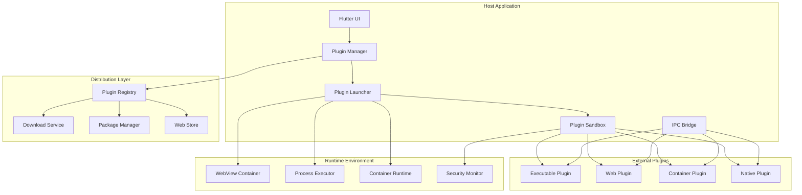

# External Plugin System Design Document

## Overview

The External Plugin System extends the existing Flutter-based plugin platform to support independent plugins developed in any programming language. This system enables developers to create plugins as standalone executables, web applications, or containerized services that communicate with the host application through standardized protocols. The design emphasizes security, cross-platform compatibility, and seamless integration while maintaining the flexibility for developers to use their preferred technology stacks.

## Architecture

### High-Level Architecture



### Component Architecture

The external plugin system follows a layered architecture that extends the existing plugin platform:

1. **Host Integration Layer**: Manages external plugin lifecycle and communication
2. **Runtime Abstraction Layer**: Provides unified interface for different plugin types
3. **Security Layer**: Enforces sandboxing and permission controls
4. **Distribution Layer**: Handles plugin discovery, download, and installation
5. **Communication Layer**: Manages IPC between host and external plugins

## Components and Interfaces

### Core External Plugin Components

#### External Plugin Manager
- **Responsibility**: Lifecycle management of external plugins
- **Key Methods**:
  - `installExternalPlugin(PluginPackage package)`: Install external plugin from package
  - `launchExternalPlugin(String pluginId)`: Start external plugin process
  - `terminateExternalPlugin(String pluginId)`: Stop external plugin safely
  - `updateExternalPlugin(String pluginId, String version)`: Update plugin to new version
  - `getExternalPluginStatus(String pluginId)`: Get current plugin status

#### Plugin Launcher
- **Responsibility**: Starting and managing external plugin processes
- **Key Methods**:
  - `launchExecutable(ExecutableConfig config)`: Launch executable-based plugins
  - `launchWebPlugin(WebConfig config)`: Launch web-based plugins in container
  - `launchContainer(ContainerConfig config)`: Launch containerized plugins
  - `monitorProcess(String processId)`: Monitor plugin process health
  - `killProcess(String processId)`: Terminate plugin process

#### IPC Bridge
- **Responsibility**: Inter-process communication with external plugins
- **Key Methods**:
  - `sendMessage(String pluginId, IPCMessage message)`: Send message to plugin
  - `registerMessageHandler(String messageType, MessageHandler handler)`: Register message handler
  - `broadcastEvent(PlatformEvent event)`: Broadcast event to all plugins
  - `establishConnection(String pluginId, ConnectionConfig config)`: Establish IPC connection
  - `closeConnection(String pluginId)`: Close IPC connection

#### Plugin Sandbox
- **Responsibility**: Security isolation and resource management
- **Key Methods**:
  - `createSandbox(SandboxConfig config)`: Create isolated environment
  - `enforcePermissions(String pluginId, List<Permission> permissions)`: Enforce permission restrictions
  - `monitorResources(String pluginId)`: Monitor resource usage
  - `applyResourceLimits(String pluginId, ResourceLimits limits)`: Apply resource constraints
  - `auditAccess(String pluginId, AccessRequest request)`: Audit resource access attempts

### Plugin Package Management

#### Plugin Package
```dart
class PluginPackage {
  final String id;
  final String name;
  final String version;
  final PluginType type;
  final Map<String, PlatformAsset> platformAssets;
  final PluginManifest manifest;
  final List<Dependency> dependencies;
  final SecuritySignature signature;
}
```

#### Plugin Manifest
```dart
class PluginManifest {
  final String id;
  final String name;
  final String version;
  final PluginType type;
  final List<Permission> requiredPermissions;
  final List<String> supportedPlatforms;
  final Map<String, dynamic> configuration;
  final List<APIEndpoint> providedAPIs;
  final List<Dependency> dependencies;
  final SecurityRequirements security;
  final UIIntegration uiIntegration;
}
```

### External Plugin Types

#### Executable Plugin
```dart
class ExecutablePlugin extends ExternalPlugin {
  final String executablePath;
  final List<String> arguments;
  final Map<String, String> environment;
  final ProcessConfig processConfig;
  
  @override
  Future<void> launch() async {
    final process = await _launcher.launchExecutable(
      ExecutableConfig(
        path: executablePath,
        args: arguments,
        env: environment,
        config: processConfig,
      ),
    );
    await _establishIPC(process);
  }
}
```

#### Web Plugin
```dart
class WebPlugin extends ExternalPlugin {
  final String entryUrl;
  final WebViewConfig webViewConfig;
  final SecurityPolicy securityPolicy;
  
  @override
  Future<void> launch() async {
    final webView = await _launcher.launchWebPlugin(
      WebConfig(
        url: entryUrl,
        config: webViewConfig,
        security: securityPolicy,
      ),
    );
    await _establishWebBridge(webView);
  }
}
```

#### Container Plugin
```dart
class ContainerPlugin extends ExternalPlugin {
  final String imageName;
  final ContainerConfig containerConfig;
  final NetworkConfig networkConfig;
  
  @override
  Future<void> launch() async {
    final container = await _launcher.launchContainer(
      ContainerConfig(
        image: imageName,
        config: containerConfig,
        network: networkConfig,
      ),
    );
    await _establishNetworkIPC(container);
  }
}
```

## Data Models

### Core Models

#### External Plugin Descriptor
```dart
class ExternalPluginDescriptor extends PluginDescriptor {
  final PluginRuntimeType runtimeType;
  final String packageUrl;
  final String packageHash;
  final PlatformRequirements platformRequirements;
  final SecurityLevel securityLevel;
  final List<String> distributionChannels;
}
```

#### Plugin Runtime Configuration
```dart
class PluginRuntimeConfig {
  final PluginRuntimeType type;
  final Map<String, dynamic> runtimeSettings;
  final ResourceLimits resourceLimits;
  final SecurityPolicy securityPolicy;
  final NetworkPolicy networkPolicy;
}
```

#### IPC Message Protocol
```dart
class IPCMessage {
  final String messageId;
  final String messageType;
  final String sourceId;
  final String targetId;
  final Map<String, dynamic> payload;
  final DateTime timestamp;
  final MessagePriority priority;
}
```

### Plugin Types and Enums

#### Plugin Runtime Type
```dart
enum PluginRuntimeType {
  executable,
  webApp,
  container,
  native,
  script
}
```

#### Security Level
```dart
enum SecurityLevel {
  minimal,    // Basic sandboxing
  standard,   // Standard security controls
  strict,     // Enhanced security with limited access
  isolated    // Maximum isolation with minimal permissions
}
```

#### Distribution Channel
```dart
enum DistributionChannel {
  directDownload,
  packageManager,
  pluginStore,
  gitRepository,
  containerRegistry
}
```

## Correctness Properties

*A property is a characteristic or behavior that should hold true across all valid executions of a system-essentially, a formal statement about what the system should do. Properties serve as the bridge between human-readable specifications and machine-verifiable correctness guarantees.*
### Property Reflection

After reviewing all properties identified in the prework analysis, I've identified several areas where properties can be consolidated to eliminate redundancy:

- Plugin package and manifest properties (1.2, 1.4, 8.1, 8.2, 8.3, 8.4) can be combined into comprehensive package validation properties
- IPC communication properties (4.1, 4.2, 4.3, 4.4, 4.5) can be streamlined into core communication reliability properties
- Security and sandboxing properties (3.1, 3.2, 3.3, 3.4, 3.5) can be consolidated into comprehensive security enforcement properties
- Plugin management properties (7.1, 7.2, 7.3, 7.4, 7.5) can be combined into unified lifecycle management properties
- Cross-platform properties (9.1, 9.2, 9.3, 9.4, 9.5) can be consolidated into platform abstraction properties

### Correctness Properties

Property 1: Multi-language plugin support
*For any* programming language that can produce executables or web applications, the External_Plugin system should successfully load and execute plugins created in that language
**Validates: Requirements 1.1**

Property 2: Plugin package completeness
*For any* plugin package, it should contain all necessary runtime dependencies, metadata, and platform-specific assets required for execution
**Validates: Requirements 1.2, 8.1, 8.2, 8.3, 8.4**

Property 3: Distribution channel universality
*For any* supported plugin format (executable, web app, container), all distribution channels should be able to handle the format correctly
**Validates: Requirements 1.3, 6.1, 6.2**

Property 4: IPC protocol consistency
*For any* external plugin regardless of implementation language, the IPC_Bridge should provide consistent communication protocols and API access
**Validates: Requirements 1.5, 4.1, 4.2, 4.3, 4.4**

Property 5: Plugin registry information completeness
*For any* plugin in the registry, querying its information should return all required fields including source, security status, and compatibility data
**Validates: Requirements 2.1**

Property 6: Download verification enforcement
*For any* plugin download, the Plugin_Host should always perform integrity and security verification before installation
**Validates: Requirements 2.2**

Property 7: Installation process reliability
*For any* valid plugin package, the installation process should complete successfully and configure the plugin appropriately
**Validates: Requirements 2.3**

Property 8: Installation failure recovery
*For any* failed plugin installation, the system should provide clear error messages and completely rollback any partial changes
**Validates: Requirements 2.4**

Property 9: Security isolation enforcement
*For any* external plugin, the Plugin_Sandbox should enforce complete isolation from the host system and other plugins
**Validates: Requirements 3.1, 3.2, 3.3**

Property 10: Resource limit enforcement
*For any* external plugin, the Plugin_Sandbox should monitor and enforce limits on CPU, memory, and network access
**Validates: Requirements 3.4, 3.5**

Property 11: IPC communication reliability
*For any* message sent between host and plugin, the IPC_Bridge should ensure reliable delivery with appropriate error handling and retry mechanisms
**Validates: Requirements 4.3, 4.5**

Property 12: UI integration consistency
*For any* plugin type (executable, web, container), the Plugin_Host should provide consistent UI embedding and theming
**Validates: Requirements 5.1, 5.2, 5.3, 5.4**

Property 13: Input event routing
*For any* user interaction with plugin UI, the Plugin_Host should correctly route input events and manage event handling
**Validates: Requirements 5.5**

Property 14: Plugin search and discovery
*For any* search query in the Plugin_Registry, the system should return relevant plugins with accurate metadata and discovery information
**Validates: Requirements 6.3**

Property 15: Dependency resolution
*For any* plugin with dependencies, the Distribution_Channel should correctly resolve and install all required dependencies
**Validates: Requirements 6.5**

Property 16: Plugin lifecycle management
*For any* plugin management operation (update, disable, remove), the Plugin_Host should execute the operation safely and maintain system stability
**Validates: Requirements 7.2, 7.3, 7.4**

Property 17: Plugin information display
*For any* installed external plugin, the management interface should display complete status and metadata information
**Validates: Requirements 7.1**

Property 18: Update rollback capability
*For any* failed plugin update, the Plugin_Host should provide rollback functionality to restore the previous working version
**Validates: Requirements 7.5**

Property 19: Requirement validation
*For any* plugin installation attempt, the Plugin_Host should validate that all system requirements are met before allowing installation
**Validates: Requirements 8.5**

Property 20: Cross-platform compatibility
*For any* cross-platform plugin, the Plugin_Package should include appropriate platform-specific assets and the runtime should adapt correctly to each platform
**Validates: Requirements 9.1, 9.2, 9.3, 9.4**

Property 21: Platform API abstraction
*For any* platform-specific feature access, the IPC_Bridge should provide unified APIs that abstract platform differences
**Validates: Requirements 9.5**

Property 22: Development mode capabilities
*For any* plugin in development mode, the Plugin_Host should provide enhanced logging, debugging, and hot-reloading capabilities
**Validates: Requirements 10.1, 10.3**

Property 23: Error information capture
*For any* plugin error, the Plugin_Host should capture and display detailed error information for debugging purposes
**Validates: Requirements 10.2**

Property 24: Testing tool provision
*For any* plugin development workflow, the Plugin_Host should provide testing tools for validating communication and integration
**Validates: Requirements 10.4**

Property 25: Environment support
*For any* plugin deployment, the Plugin_Host should support both development and production environments with appropriate configurations
**Validates: Requirements 10.5**

## Error Handling

### Plugin Lifecycle Errors
- **Installation Failures**: Complete rollback with detailed error reporting
- **Launch Failures**: Graceful degradation with retry mechanisms
- **Runtime Crashes**: Automatic restart with crash reporting
- **Update Failures**: Rollback to previous version with user notification

### Communication Errors
- **IPC Failures**: Automatic reconnection with exponential backoff
- **Protocol Errors**: Message validation with error responses
- **Timeout Handling**: Configurable timeouts with fallback mechanisms
- **Serialization Errors**: Safe error handling with data validation

### Security Errors
- **Permission Violations**: Immediate termination with audit logging
- **Sandbox Escapes**: System-wide security alerts and plugin blacklisting
- **Malware Detection**: Quarantine and removal with user notification
- **Certificate Validation**: Strict validation with clear error messages

### Platform Errors
- **Resource Exhaustion**: Automatic resource cleanup and plugin throttling
- **Platform Incompatibility**: Clear compatibility error messages
- **Network Failures**: Offline mode fallback with sync recovery
- **Storage Errors**: Alternative storage mechanisms with data recovery

## Testing Strategy

### Dual Testing Approach

The external plugin system will employ both unit testing and property-based testing to ensure comprehensive coverage:

**Unit Testing Requirements:**
- Unit tests will verify specific plugin integration scenarios and edge cases
- Integration tests will validate cross-platform plugin behavior
- Mock implementations will simulate different plugin types and runtime environments
- Unit tests will focus on concrete error conditions and boundary scenarios

**Property-Based Testing Requirements:**
- Property-based tests will use Dart's testing framework with custom plugin generators
- Each property-based test will run a minimum of 100 iterations to ensure thorough coverage
- Property-based tests will verify universal properties across all plugin types and platforms
- Each property-based test will be tagged with comments referencing the specific correctness property from this design document using the format: **Feature: external-plugin-system, Property {number}: {property_text}**
- Property-based tests will use intelligent generators that create valid plugin packages, manifests, and communication scenarios
- Each correctness property will be implemented by a single property-based test

**Testing Framework Configuration:**
- Primary testing framework: Flutter's built-in testing framework with custom extensions
- Property-based testing: Custom implementation using Dart's Random class and test framework
- Minimum iterations per property test: 100
- Test isolation: Each plugin test will run in completely isolated sandbox environments
- Multi-platform testing: Separate test suites for mobile, desktop, and web plugin scenarios

**Test Coverage Requirements:**
- All correctness properties must have corresponding property-based tests
- Critical plugin lifecycle flows must have integration tests
- Security and sandboxing features must have comprehensive security tests
- Cross-platform compatibility must have platform-specific test suites

The combination of unit and property-based testing will provide comprehensive validation: unit tests will catch specific integration bugs and verify concrete plugin behaviors, while property tests will verify that universal properties hold across all plugin types, platforms, and communication scenarios, ensuring robust and secure external plugin operation.

## Implementation Details

### Plugin Package Format

#### Standard Package Structure
```
plugin-package/
├── manifest.json                 # Plugin metadata and configuration
├── platforms/                    # Platform-specific assets
│   ├── windows/
│   │   ├── plugin.exe           # Windows executable
│   │   └── dependencies/        # Windows-specific dependencies
│   ├── linux/
│   │   ├── plugin              # Linux executable
│   │   └── dependencies/       # Linux-specific dependencies
│   ├── macos/
│   │   ├── plugin.app          # macOS application bundle
│   │   └── dependencies/       # macOS-specific dependencies
│   ├── android/
│   │   ├── plugin.apk          # Android package (if applicable)
│   │   └── dependencies/       # Android-specific dependencies
│   ├── ios/
│   │   ├── plugin.ipa          # iOS package (if applicable)
│   │   └── dependencies/       # iOS-specific dependencies
│   └── web/
│       ├── index.html          # Web application entry point
│       ├── assets/             # Web assets
│       └── dependencies/       # Web-specific dependencies
├── resources/                   # Shared resources
│   ├── icons/                  # Plugin icons
│   ├── localization/           # Localization files
│   └── documentation/          # Plugin documentation
├── security/
│   ├── signature.sig           # Digital signature
│   ├── certificate.pem         # Security certificate
│   └── permissions.json        # Required permissions
└── metadata/
    ├── changelog.md            # Version history
    ├── license.txt             # License information
    └── readme.md               # Plugin documentation
```

### IPC Communication Protocol

#### Message Format
```json
{
  "messageId": "uuid-v4",
  "messageType": "api_call|event|response|error",
  "sourceId": "host|plugin_id",
  "targetId": "host|plugin_id|broadcast",
  "timestamp": "ISO-8601",
  "priority": "low|normal|high|critical",
  "payload": {
    "method": "method_name",
    "parameters": {},
    "data": {},
    "error": {
      "code": "error_code",
      "message": "error_message",
      "details": {}
    }
  }
}
```

#### Communication Channels
- **Named Pipes**: For executable plugins on desktop platforms
- **WebSocket**: For web-based plugins and cross-platform communication
- **HTTP API**: For container-based plugins and remote plugins
- **Shared Memory**: For high-performance data exchange
- **File System**: For asynchronous message queuing

### Security Architecture

#### Sandbox Implementation
```dart
class PluginSandbox {
  final String pluginId;
  final SecurityLevel securityLevel;
  final ResourceLimits resourceLimits;
  final List<Permission> allowedPermissions;
  
  Future<void> createSandbox() async {
    // Create isolated file system
    await _createIsolatedFileSystem();
    
    // Set up network restrictions
    await _configureNetworkPolicy();
    
    // Apply resource limits
    await _applyResourceLimits();
    
    // Configure permission enforcement
    await _setupPermissionEnforcement();
  }
  
  Future<bool> validateAccess(AccessRequest request) async {
    // Check permissions
    if (!_hasPermission(request.permission)) {
      return false;
    }
    
    // Validate resource usage
    if (!_withinResourceLimits(request)) {
      return false;
    }
    
    // Apply security policies
    return await _applySecurityPolicies(request);
  }
}
```

#### Permission System
```dart
enum Permission {
  // File system permissions
  fileSystemRead,
  fileSystemWrite,
  fileSystemExecute,
  
  // Network permissions
  networkAccess,
  networkServer,
  networkClient,
  
  // System permissions
  systemNotifications,
  systemClipboard,
  systemCamera,
  systemMicrophone,
  
  // Platform permissions
  platformServices,
  platformUI,
  platformStorage,
  
  // Inter-plugin permissions
  pluginCommunication,
  pluginDataSharing,
}
```

### Cross-Platform Considerations

#### Platform Abstraction Layer
```dart
abstract class PlatformAdapter {
  Future<void> launchPlugin(PluginConfig config);
  Future<void> terminatePlugin(String pluginId);
  Future<IPCChannel> createIPCChannel(String pluginId);
  Future<void> setupSandbox(SandboxConfig config);
  Future<void> enforceResourceLimits(ResourceLimits limits);
}

class WindowsPlatformAdapter extends PlatformAdapter {
  @override
  Future<void> launchPlugin(PluginConfig config) async {
    // Windows-specific plugin launching
    final process = await Process.start(
      config.executablePath,
      config.arguments,
      environment: config.environment,
    );
    
    // Set up Windows-specific security and sandboxing
    await _setupWindowsSandbox(process.pid);
  }
}

class LinuxPlatformAdapter extends PlatformAdapter {
  @override
  Future<void> launchPlugin(PluginConfig config) async {
    // Linux-specific plugin launching with containerization
    final container = await _createLinuxContainer(config);
    await container.start();
    
    // Set up Linux-specific security policies
    await _setupLinuxSecurity(container);
  }
}
```

### Plugin Development Tools

#### Plugin Generator CLI
```bash
# Create new plugin project
plugin-cli create --name my-plugin --type executable --language python

# Generate plugin package
plugin-cli package --platform all --output my-plugin.pkg

# Test plugin locally
plugin-cli test --plugin my-plugin.pkg --host-version 1.0.0

# Publish plugin
plugin-cli publish --plugin my-plugin.pkg --registry official
```

#### Development SDK
```dart
// Plugin SDK for external plugins
class PluginSDK {
  static Future<void> initialize() async {
    // Initialize IPC connection with host
    await _connectToHost();
    
    // Register plugin capabilities
    await _registerCapabilities();
    
    // Set up event handlers
    await _setupEventHandlers();
  }
  
  static Future<T> callHostAPI<T>(String method, Map<String, dynamic> params) async {
    final message = IPCMessage(
      messageType: 'api_call',
      payload: {'method': method, 'parameters': params},
    );
    
    final response = await _sendMessage(message);
    return response.payload['result'] as T;
  }
  
  static void onHostEvent(String eventType, Function(Map<String, dynamic>) handler) {
    _eventHandlers[eventType] = handler;
  }
}
```

## Deployment Architecture

### Plugin Distribution Infrastructure

#### Plugin Registry Service
```dart
class PluginRegistryService {
  Future<List<PluginDescriptor>> searchPlugins(SearchQuery query) async {
    // Search plugins by name, category, tags, etc.
    return await _searchIndex.search(query);
  }
  
  Future<PluginPackage> downloadPlugin(String pluginId, String version) async {
    // Download plugin package with integrity verification
    final package = await _downloadService.download(pluginId, version);
    await _verifyPackageIntegrity(package);
    return package;
  }
  
  Future<void> publishPlugin(PluginPackage package) async {
    // Validate and publish plugin to registry
    await _validatePlugin(package);
    await _securityScan(package);
    await _publishToRegistry(package);
  }
}
```

#### Distribution Channels
- **Official Plugin Store**: Curated plugins with security verification
- **Community Registry**: Open registry for community-contributed plugins
- **Direct Download**: Support for direct plugin URLs
- **Package Managers**: Integration with system package managers
- **Git Repositories**: Support for Git-based plugin distribution
- **Container Registries**: Support for containerized plugins

### Monitoring and Analytics

#### Plugin Performance Monitoring
```dart
class PluginMonitor {
  void trackPluginMetrics(String pluginId) {
    // Monitor resource usage
    _resourceMonitor.track(pluginId);
    
    // Track performance metrics
    _performanceMonitor.track(pluginId);
    
    // Monitor security events
    _securityMonitor.track(pluginId);
    
    // Track user engagement
    _engagementMonitor.track(pluginId);
  }
  
  Future<PluginHealthReport> generateHealthReport(String pluginId) async {
    return PluginHealthReport(
      resourceUsage: await _getResourceUsage(pluginId),
      performanceMetrics: await _getPerformanceMetrics(pluginId),
      securityEvents: await _getSecurityEvents(pluginId),
      errorRate: await _getErrorRate(pluginId),
      userSatisfaction: await _getUserSatisfaction(pluginId),
    );
  }
}
```

This comprehensive design provides a robust foundation for building an external plugin system that supports multiple programming languages, distribution channels, and deployment scenarios while maintaining security, performance, and user experience standards across all supported platforms.