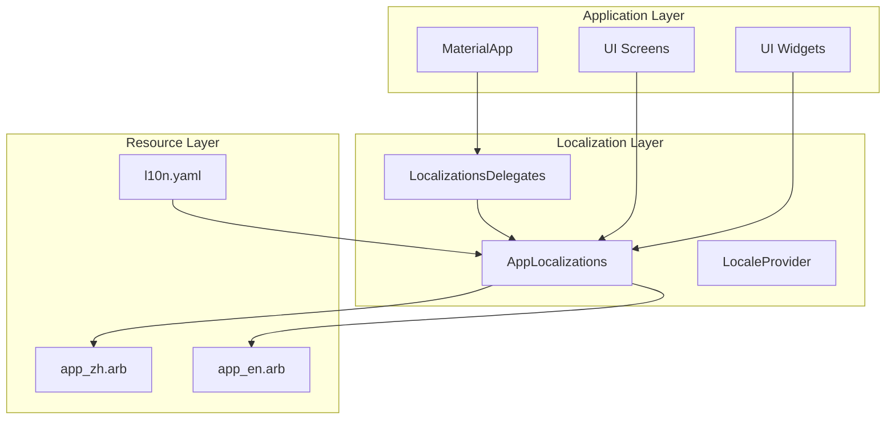

# Design Document: Internationalization (国际化)

## Overview

本设计文档描述了 Flutter 插件平台的全局国际化实现方案。采用 Flutter 官方推荐的 `flutter_localizations` 和 `intl` 包，通过 ARB (Application Resource Bundle) 文件管理翻译资源，实现中文（默认）和英文的多语言支持。

### Goals
- 所有用户可见文本支持国际化
- 中文作为默认语言
- 统一的翻译键命名规范
- 易于维护和扩展的翻译架构

### Non-Goals
- 运行时动态加载新语言包
- 第三方翻译服务集成
- 插件内部的独立国际化（插件使用平台提供的国际化服务）

## Architecture



## Components and Interfaces

### 1. Localization Configuration (l10n.yaml)

配置文件定义 ARB 文件位置和生成选项：

```yaml
arb-dir: lib/l10n
template-arb-file: app_zh.arb
output-localization-file: app_localizations.dart
output-class: AppLocalizations
synthetic-package: false
output-dir: lib/l10n/generated
```

### 2. AppLocalizations Class

Flutter 自动生成的本地化类，提供类型安全的翻译访问：

```dart
// 使用方式
import 'package:plugin_platform/l10n/generated/app_localizations.dart';

// 在 Widget 中使用
Text(AppLocalizations.of(context)!.appTitle)

// 简化访问（可选扩展）
extension LocalizationsX on BuildContext {
  AppLocalizations get l10n => AppLocalizations.of(this)!;
}
```

### 3. LocaleProvider

管理当前语言设置和语言切换：

```dart
/// 语言设置提供者
class LocaleProvider extends ChangeNotifier {
  Locale _locale = const Locale('zh', 'CN');
  
  Locale get locale => _locale;
  
  /// 支持的语言列表
  static const List<Locale> supportedLocales = [
    Locale('zh', 'CN'),
    Locale('en', 'US'),
  ];
  
  /// 切换语言
  Future<void> setLocale(Locale locale) async {
    if (!supportedLocales.contains(locale)) return;
    _locale = locale;
    await _saveLocalePreference(locale);
    notifyListeners();
  }
  
  /// 从持久化存储加载语言设置
  Future<void> loadSavedLocale() async {
    final savedLocale = await _loadLocalePreference();
    if (savedLocale != null) {
      _locale = savedLocale;
      notifyListeners();
    }
  }
}
```

### 4. MaterialApp Configuration

应用入口配置国际化支持：

```dart
MaterialApp(
  localizationsDelegates: const [
    AppLocalizations.delegate,
    GlobalMaterialLocalizations.delegate,
    GlobalWidgetsLocalizations.delegate,
    GlobalCupertinoLocalizations.delegate,
  ],
  supportedLocales: LocaleProvider.supportedLocales,
  locale: localeProvider.locale,
  // ...
)
```

## Data Models

### ARB File Structure

#### app_zh.arb (中文 - 模板文件)

```json
{
  "@@locale": "zh",
  
  "appTitle": "插件平台",
  "@appTitle": {
    "description": "应用标题"
  },
  
  "common_confirm": "确认",
  "common_cancel": "取消",
  "common_save": "保存",
  "common_delete": "删除",
  "common_close": "关闭",
  "common_retry": "重试",
  "common_loading": "加载中...",
  "common_search": "搜索",
  
  "error_unknown": "发生未知错误",
  "error_network": "网络连接失败",
  "error_loadFailed": "加载失败: {message}",
  "@error_loadFailed": {
    "placeholders": {
      "message": {"type": "String"}
    }
  },
  
  "hint_searchPlugins": "搜索插件...",
  "hint_inputRequired": "此字段为必填项",
  
  "button_launch": "启动",
  "button_install": "安装",
  "button_uninstall": "卸载",
  "button_enable": "启用",
  "button_disable": "禁用",
  "button_update": "更新",
  "button_rollback": "回滚",
  
  "dialog_confirmTitle": "确认操作",
  "dialog_uninstallPlugin": "确定要卸载此插件吗？此操作无法撤销。",
  "dialog_removePlugin": "确定要移除此插件吗？此操作无法撤销。",
  
  "plugin_statusEnabled": "已启用",
  "plugin_statusDisabled": "已禁用",
  "plugin_typeTool": "工具",
  "plugin_typeGame": "游戏",
  "plugin_noPlugins": "暂无插件",
  "plugin_installFirst": "安装您的第一个插件开始使用",
  "plugin_launchSuccess": "插件 {name} 已启动",
  "@plugin_launchSuccess": {
    "placeholders": {
      "name": {"type": "String"}
    }
  },
  
  "pet_title": "桌面宠物",
  "pet_notSupported": "桌面宠物不可用",
  "pet_webLimitation": "Web 平台不支持桌面宠物功能",
  "pet_enableMode": "启用宠物模式",
  "pet_exitMode": "退出宠物模式",
  "pet_returnToApp": "返回主应用",
  "pet_settings": "宠物设置",
  "pet_quickActions": "快捷操作",
  
  "settings_language": "语言设置",
  "settings_theme": "主题设置"
}
```

#### app_en.arb (英文)

```json
{
  "@@locale": "en",
  
  "appTitle": "Plugin Platform",
  
  "common_confirm": "Confirm",
  "common_cancel": "Cancel",
  "common_save": "Save",
  "common_delete": "Delete",
  "common_close": "Close",
  "common_retry": "Retry",
  "common_loading": "Loading...",
  "common_search": "Search",
  
  "error_unknown": "An unknown error occurred",
  "error_network": "Network connection failed",
  "error_loadFailed": "Failed to load: {message}",
  
  "hint_searchPlugins": "Search plugins...",
  "hint_inputRequired": "This field is required",
  
  "button_launch": "Launch",
  "button_install": "Install",
  "button_uninstall": "Uninstall",
  "button_enable": "Enable",
  "button_disable": "Disable",
  "button_update": "Update",
  "button_rollback": "Rollback",
  
  "dialog_confirmTitle": "Confirm Action",
  "dialog_uninstallPlugin": "Are you sure you want to uninstall this plugin? This action cannot be undone.",
  "dialog_removePlugin": "Are you sure you want to remove this plugin? This action cannot be undone.",
  
  "plugin_statusEnabled": "Enabled",
  "plugin_statusDisabled": "Disabled",
  "plugin_typeTool": "Tool",
  "plugin_typeGame": "Game",
  "plugin_noPlugins": "No Plugins Available",
  "plugin_installFirst": "Install your first plugin to get started",
  "plugin_launchSuccess": "Plugin {name} launched",
  
  "pet_title": "Desktop Pet",
  "pet_notSupported": "Desktop Pet Not Available",
  "pet_webLimitation": "Desktop Pet is not supported on web platform",
  "pet_enableMode": "Enable Pet Mode",
  "pet_exitMode": "Exit Pet Mode",
  "pet_returnToApp": "Return to Main App",
  "pet_settings": "Pet Settings",
  "pet_quickActions": "Quick Actions",
  
  "settings_language": "Language",
  "settings_theme": "Theme"
}
```

## Correctness Properties

*A property is a characteristic or behavior that should hold true across all valid executions of a system-essentially, a formal statement about what the system should do. Properties serve as the bridge between human-readable specifications and machine-verifiable correctness guarantees.*

### Property 1: Localization Initialization
*For any* application startup, AppLocalizations.of(context) SHALL return a non-null instance after MaterialApp is built with proper localization delegates.
**Validates: Requirements 1.1, 1.4**

### Property 2: Default Locale is Chinese
*For any* fresh application installation without saved preferences, the system SHALL use zh_CN as the default locale.
**Validates: Requirements 2.1**

### Property 3: Locale Change Propagation
*For any* locale change via LocaleProvider.setLocale(), all widgets using AppLocalizations SHALL receive updated translations on the next build cycle.
**Validates: Requirements 2.2**

### Property 4: Translation Fallback
*For any* missing translation key in a non-default locale, the system SHALL return the Chinese (template) translation as fallback.
**Validates: Requirements 2.4**

### Property 5: ARB Key Naming Convention
*For any* key in the ARB files, the key SHALL follow the naming convention with appropriate prefix (common_, error_, hint_, button_, dialog_, plugin_, pet_, settings_).
**Validates: Requirements 9.1-9.8**

### Property 6: Locale Persistence Round Trip
*For any* locale setting saved via LocaleProvider, loading the saved preference SHALL return the same locale value.
**Validates: Requirements 2.2**

## Error Handling

### Missing Translation Keys
- 使用 Flutter 的默认回退机制，返回模板语言（中文）的翻译
- 开发模式下在控制台输出警告信息

### Invalid Locale
- 如果请求不支持的语言，保持当前语言设置不变
- 记录警告日志

### Locale Loading Failure
- 如果无法从持久化存储加载语言设置，使用默认中文
- 不影响应用正常启动

## Testing Strategy

### Unit Tests
- 测试 LocaleProvider 的语言切换逻辑
- 测试语言设置的持久化存储和加载
- 测试 ARB 键命名规范验证

### Property-Based Tests
使用 `test` 包进行属性测试：

1. **Locale Persistence Round Trip**: 验证任意有效 locale 保存后能正确加载
2. **ARB Key Naming Validation**: 验证所有 ARB 键遵循命名规范
3. **Default Locale Property**: 验证无保存设置时默认使用中文

### Widget Tests
- 测试 MaterialApp 正确配置 localizationsDelegates
- 测试语言切换后 UI 文本更新
- 测试各屏幕使用 AppLocalizations 获取文本

### Integration Tests
- 测试完整的语言切换流程
- 测试应用重启后语言设置保持
