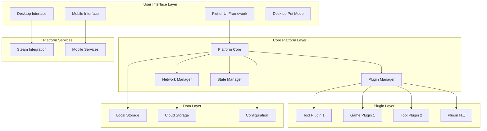

# Plugin Platform Design Document

## Overview

The Plugin Platform is a cross-platform application built with Flutter that serves as a unified hub for tools and mini-games. The platform supports both mobile devices and Steam desktop environments, with the Steam version offering additional desktop pet functionality. The architecture emphasizes modularity through a robust plugin system, dual operation modes (local/online), and seamless cross-platform data synchronization.

## Architecture

### High-Level Architecture



### Component Architecture

The platform follows a layered architecture with clear separation of concerns:

1. **Presentation Layer**: Flutter-based UI with platform-specific adaptations
2. **Business Logic Layer**: Core platform services and plugin management
3. **Data Access Layer**: Local and cloud storage abstraction
4. **Plugin Layer**: Isolated plugin execution environment

## Components and Interfaces

### Core Platform Components

#### Platform Core
- **Responsibility**: Central orchestration of all platform services
- **Key Methods**:
  - `initialize()`: Bootstrap the platform
  - `switchMode(OperationMode mode)`: Toggle between local/online modes
  - `getPluginManager()`: Access plugin management services
  - `getNetworkManager()`: Access network services

#### Plugin Manager
- **Responsibility**: Plugin lifecycle management and security
- **Key Methods**:
  - `loadPlugin(PluginDescriptor descriptor)`: Load and initialize plugins
  - `unloadPlugin(String pluginId)`: Safely unload plugins
  - `validatePlugin(PluginPackage package)`: Security validation
  - `getAvailablePlugins()`: List all available plugins
  - `getActivePlugins()`: List currently running plugins

#### Network Manager
- **Responsibility**: Handle all network communications and API management
- **Key Methods**:
  - `configureEndpoints(BackendConfig config)`: Set API endpoints
  - `syncUserData()`: Synchronize user data across devices
  - `validateConnection()`: Test network connectivity
  - `handleOfflineMode()`: Manage offline scenarios

#### State Manager
- **Responsibility**: Application state management and persistence
- **Key Methods**:
  - `saveState(String key, dynamic value)`: Persist application state
  - `loadState(String key)`: Retrieve saved state
  - `clearState()`: Reset application state
  - `syncState()`: Synchronize state across devices

### Plugin Interface

#### IPlugin Interface
```dart
abstract class IPlugin {
  String get id;
  String get name;
  String get version;
  PluginType get type; // TOOL or GAME
  
  Future<void> initialize(PluginContext context);
  Future<void> dispose();
  Widget buildUI(BuildContext context);
  Future<void> onStateChanged(PluginState state);
}
```

#### Plugin Context
```dart
class PluginContext {
  final IPlatformServices platformServices;
  final IDataStorage dataStorage;
  final INetworkAccess networkAccess;
  final Map<String, dynamic> configuration;
}
```

### Platform Services Interface

#### IPlatformServices
```dart
abstract class IPlatformServices {
  Future<void> showNotification(String message);
  Future<void> requestPermission(Permission permission);
  Future<void> openExternalUrl(String url);
  Stream<PlatformEvent> get eventStream;
}
```

## Data Models

### Core Models

#### Plugin Descriptor
```dart
class PluginDescriptor {
  final String id;
  final String name;
  final String version;
  final PluginType type;
  final List<Permission> requiredPermissions;
  final Map<String, dynamic> metadata;
  final String entryPoint;
}
```

#### User Profile
```dart
class UserProfile {
  final String userId;
  final String displayName;
  final Map<String, dynamic> preferences;
  final List<String> installedPlugins;
  final DateTime lastSyncTime;
}
```

#### Backend Configuration
```dart
class BackendConfig {
  final String baseUrl;
  final String apiVersion;
  final Map<String, String> endpoints;
  final AuthenticationConfig auth;
  final int timeoutSeconds;
}
```

#### Operation Mode
```dart
enum OperationMode {
  local,
  online
}
```

### Plugin Models

#### Plugin State
```dart
enum PluginState {
  inactive,
  loading,
  active,
  paused,
  error
}
```

#### Plugin Type
```dart
enum PluginType {
  tool,
  game
}
```

## Correctness Properties

*A property is a characteristic or behavior that should hold true across all valid executions of a system-essentially, a formal statement about what the system should do. Properties serve as the bridge between human-readable specifications and machine-verifiable correctness guarantees.*
### Property Reflection

After reviewing all properties identified in the prework analysis, I've identified several areas where properties can be consolidated to eliminate redundancy:

- Plugin loading, registration, and validation properties (2.1, 2.2, 6.1) can be combined into comprehensive plugin lifecycle properties
- Data synchronization properties (9.1, 9.2, 9.3) can be consolidated into unified sync properties
- Plugin management properties (5.1, 5.3, 5.4, 5.5) can be streamlined to avoid overlap
- Network and configuration properties (8.1, 8.2, 8.3, 8.5) can be combined for better coverage

### Correctness Properties

Property 1: Plugin lifecycle management
*For any* valid plugin descriptor, loading the plugin should result in successful registration and availability in the plugin registry
**Validates: Requirements 2.1, 2.2**

Property 2: Plugin state preservation
*For any* plugin with state, switching away from and back to the plugin should preserve its previous state
**Validates: Requirements 1.4**

Property 3: Plugin error isolation
*For any* plugin that crashes or fails to load, the failure should not affect other plugins or the core platform functionality
**Validates: Requirements 2.3, 6.3**

Property 4: Plugin API access
*For any* loaded plugin, it should have access to the standardized plugin API and platform services
**Validates: Requirements 2.4**

Property 5: Plugin hot-reloading
*For any* plugin update, the new version should be loaded without requiring application restart while preserving system stability
**Validates: Requirements 2.5**

Property 6: User preference persistence
*For any* user preference setting, the setting should be respected and maintained across application sessions
**Validates: Requirements 3.5**

Property 7: Device orientation adaptation
*For any* device orientation change on mobile, the interface should adapt appropriately without losing functionality
**Validates: Requirements 4.4**

Property 8: Plugin information completeness
*For any* installed plugin, querying its information should return all required fields including version, description, and permissions
**Validates: Requirements 5.5**

Property 9: Plugin uninstallation cleanup
*For any* plugin that is uninstalled, all associated resources and data should be completely removed from the system
**Validates: Requirements 5.3**

Property 10: Plugin enable/disable functionality
*For any* plugin, enabling or disabling it should correctly change its state without affecting other plugins
**Validates: Requirements 5.4**

Property 11: Security validation enforcement
*For any* plugin being loaded, security validation should occur and prevent loading of plugins that don't meet security requirements
**Validates: Requirements 6.1**

Property 12: Permission-based access control
*For any* plugin attempting to access system resources, access should be granted only if the plugin has the required permissions
**Validates: Requirements 6.2**

Property 13: Plugin sandboxing
*For any* plugin, it should be unable to access system resources outside of its designated sandbox environment
**Validates: Requirements 6.4**

Property 14: Network access monitoring
*For any* plugin making network requests, the requests should be monitored and validated by the platform
**Validates: Requirements 6.5**

Property 15: Local mode offline operation
*For any* functionality in Local_Mode, no network access should be attempted and all operations should work offline
**Validates: Requirements 7.2**

Property 16: Online mode network features
*For any* network-dependent feature in Online_Mode, the feature should be available and functional
**Validates: Requirements 7.3**

Property 17: Mode switching data preservation
*For any* user data, switching between Local_Mode and Online_Mode should preserve data integrity
**Validates: Requirements 7.4**

Property 18: Backend configuration interface
*For any* configuration setting, the Backend_Configuration should provide appropriate interfaces for modification
**Validates: Requirements 8.1**

Property 19: Endpoint validation and updates
*For any* API endpoint change, the Network_Manager should validate connectivity and update configurations accordingly
**Validates: Requirements 8.2**

Property 20: Environment-specific configuration
*For any* environment setting, the Backend_Configuration should maintain separate configurations for different environments
**Validates: Requirements 8.3**

Property 21: Hot configuration updates
*For any* configuration change, the updates should be applied immediately without requiring application restart
**Validates: Requirements 8.5**

Property 22: Online data synchronization
*For any* user data change in Online_Mode, the data should be synchronized across all user devices
**Validates: Requirements 9.1, 9.2, 9.3**

Property 23: Network interruption recovery
*For any* network interruption during sync, data should be synchronized when connectivity is restored
**Validates: Requirements 9.4**

Property 24: Sync conflict resolution
*For any* synchronization conflict, the system should provide mechanisms to resolve conflicts appropriately
**Validates: Requirements 9.5**

## Error Handling

### Plugin Error Handling
- **Plugin Load Failures**: Graceful degradation with user notification
- **Plugin Runtime Errors**: Isolation and recovery without affecting other plugins
- **Plugin Communication Errors**: Timeout handling and retry mechanisms

### Network Error Handling
- **Connection Failures**: Automatic retry with exponential backoff
- **API Errors**: Proper error codes and user-friendly messages
- **Sync Conflicts**: User-guided conflict resolution interface

### Platform Error Handling
- **Resource Exhaustion**: Memory and CPU monitoring with plugin throttling
- **Storage Errors**: Fallback to alternative storage mechanisms
- **Permission Errors**: Clear user guidance for permission resolution

## Testing Strategy

### Dual Testing Approach

The platform will employ both unit testing and property-based testing to ensure comprehensive coverage:

**Unit Testing Requirements:**
- Unit tests will verify specific examples, edge cases, and error conditions
- Integration tests will validate component interactions and platform-specific features
- Mock implementations will be used for external dependencies during unit testing
- Unit tests will focus on concrete scenarios and boundary conditions

**Property-Based Testing Requirements:**
- Property-based tests will use Dart's native testing framework with custom random data generators
- Each property-based test will run a minimum of 100 iterations to ensure thorough coverage
- Property-based tests will verify universal properties across all valid inputs
- Each property-based test will be tagged with comments referencing the specific correctness property from this design document using the format: **Feature: plugin-platform, Property {number}: {property_text}**
- Property-based tests will use intelligent generators that constrain inputs to valid ranges
- Each correctness property will be implemented by a single property-based test

**Testing Framework Configuration:**
- Primary testing framework: Flutter's built-in testing framework
- Property-based testing: Custom implementation using Dart's Random class and test framework
- Minimum iterations per property test: 100
- Test isolation: Each plugin test will run in isolated environments
- Platform testing: Separate test suites for mobile and desktop platforms

**Test Coverage Requirements:**
- All correctness properties must have corresponding property-based tests
- Critical user flows must have integration tests
- Error conditions and edge cases must have unit tests
- Platform-specific features must have targeted test suites

The combination of unit and property-based testing will provide comprehensive validation: unit tests will catch specific bugs and verify concrete behaviors, while property tests will verify that universal properties hold across the entire input space, ensuring robust and reliable platform operation.

## Implementation Details

### Plugin System Architecture

#### Plugin Loading Mechanism
```dart
class PluginLoader {
  Future<IPlugin> loadPlugin(PluginDescriptor descriptor) async {
    // 1. Validate plugin security requirements
    await _validateSecurity(descriptor);
    
    // 2. Create isolated execution context
    final context = await _createPluginContext(descriptor);
    
    // 3. Load plugin code dynamically
    final plugin = await _instantiatePlugin(descriptor, context);
    
    // 4. Initialize plugin with platform services
    await plugin.initialize(context);
    
    return plugin;
  }
}
```

#### Plugin Communication Protocol
- **Event-driven architecture**: Plugins communicate through platform events
- **Message passing**: Secure inter-plugin communication via platform mediator
- **Resource sharing**: Controlled access to shared resources through platform APIs

### Cross-Platform Considerations

#### Flutter Platform Channels
- **Steam Integration**: Custom platform channel for Steam-specific features
- **Mobile Services**: Platform channels for mobile-specific functionality
- **Desktop Pet Mode**: Windows/macOS specific implementation for always-on-top behavior

#### Data Storage Strategy
- **Local Storage**: SQLite for offline data persistence
- **Cloud Storage**: Firebase/custom backend for online synchronization
- **Configuration**: Secure key-value storage for settings and preferences

### Security Architecture

#### Plugin Sandboxing
```dart
class PluginSandbox {
  final Set<Permission> allowedPermissions;
  final ResourceLimits limits;
  
  Future<T> executeInSandbox<T>(Future<T> Function() operation) async {
    // Enforce resource limits and permission checks
    return await _withLimits(() async {
      return await _withPermissionCheck(operation);
    });
  }
}
```

#### Permission System
- **Granular Permissions**: File access, network access, system notifications
- **Runtime Permission Requests**: Dynamic permission granting
- **Permission Auditing**: Logging and monitoring of permission usage

### Performance Considerations

#### Plugin Lifecycle Management
- **Lazy Loading**: Plugins loaded only when needed
- **Memory Management**: Automatic cleanup of inactive plugins
- **Resource Monitoring**: CPU and memory usage tracking per plugin

#### Optimization Strategies
- **Plugin Caching**: Compiled plugin caching for faster startup
- **Background Processing**: Non-blocking plugin operations
- **Progressive Loading**: Incremental plugin feature loading

## Deployment Architecture

### Mobile Deployment
- **App Stores**: iOS App Store and Google Play Store distribution
- **Plugin Distribution**: In-app plugin marketplace with secure download
- **Update Mechanism**: Over-the-air updates for both platform and plugins

### Steam Deployment
- **Steam Workshop**: Plugin distribution through Steam Workshop
- **Steam Integration**: Achievement system, overlay support, cloud saves
- **Desktop Pet Mode**: System tray integration and window management

### Backend Infrastructure
- **API Gateway**: Centralized API management and routing
- **Plugin Registry**: Centralized plugin metadata and distribution
- **User Management**: Authentication, authorization, and profile management
- **Analytics**: Usage tracking and performance monitoring

## Development Workflow

### Plugin Development Kit (PDK)
```dart
// Example plugin template
class ExamplePlugin extends IPlugin {
  @override
  String get id => 'com.example.tool';
  
  @override
  Widget buildUI(BuildContext context) {
    return PluginScaffold(
      title: name,
      body: _buildPluginContent(),
    );
  }
  
  Widget _buildPluginContent() {
    // Plugin-specific UI implementation
  }
}
```

### Development Tools
- **Plugin Generator**: CLI tool for creating plugin boilerplate
- **Testing Framework**: Integrated testing tools for plugin validation
- **Documentation Generator**: Automatic API documentation generation
- **Debug Tools**: Plugin debugging and profiling utilities

## Monitoring and Analytics

### Performance Metrics
- **Plugin Load Times**: Monitoring plugin initialization performance
- **Resource Usage**: Tracking CPU, memory, and network usage per plugin
- **Error Rates**: Plugin crash and error frequency tracking
- **User Engagement**: Plugin usage patterns and user behavior analytics

### Health Monitoring
- **System Health**: Overall platform stability and performance
- **Plugin Health**: Individual plugin performance and reliability
- **Network Health**: API response times and connectivity status
- **User Experience**: Performance impact on user interactions

This design provides a comprehensive foundation for building a robust, secure, and scalable plugin platform that meets all the specified requirements while maintaining high performance and user experience standards across mobile and desktop platforms.